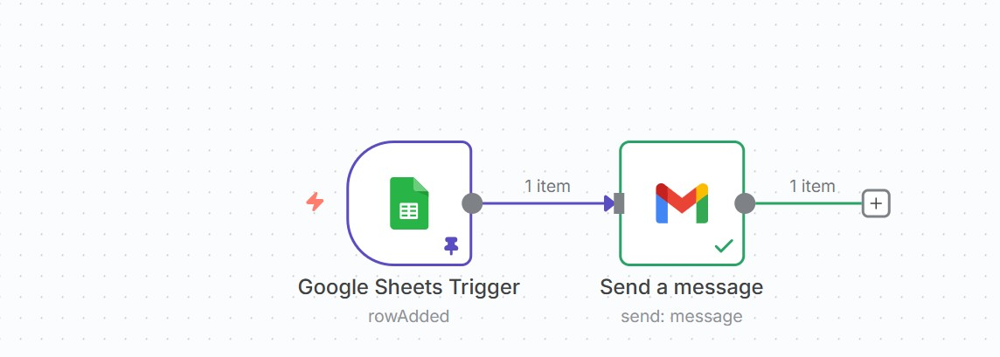
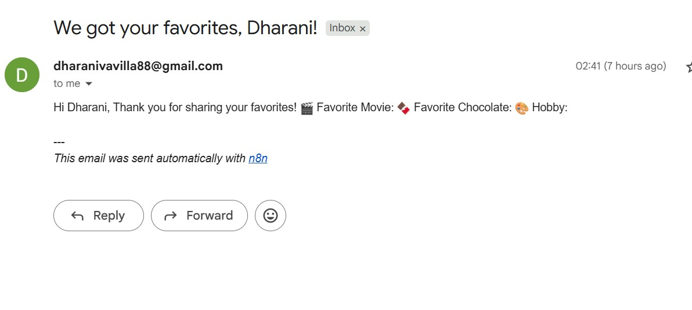

# 💌 Favorites Collector Automation using n8n, Google Sheets & Gmail

---

## 📖 Overview

The **Favorites Collector Automation** is an **n8n-based workflow** designed to automatically send **personalized thank-you emails** whenever a new entry is added to a Google Sheet.  
Each time someone fills in their favorite movie, chocolate, and hobby through a Google Form (connected to Google Sheets), n8n detects the new row and instantly sends a customized acknowledgment email using Gmail.

---

## 🧠 Objective

To automate the process of **responding to form submissions** without manual effort — improving efficiency, personalization, and user engagement.

---

## ⚙️ Workflow Description

### 🔹 Step 1: Trigger – Google Sheets
- **Node Used:** `Google Sheets Trigger`
- **Function:** Monitors a connected Google Sheet.
- **Event:** `On New Row Added`
- **Action:** When a new row is added, n8n fetches the data fields (Name, Favorite Movie, Chocolate, Hobby, and Email).

### 🔹 Step 2: Action – Gmail
- **Node Used:** `Send Email (Gmail)`
- **Function:** Sends a personalized email using Gmail API.
- **Message Template:**

Subject: We got your favorites, {{Name}}!

Hi {{Name}},
Thank you for sharing your favorites! 🎬

🍿 Favorite Movie: {{Fav Movie}}
🍫 Favorite Chocolate: {{Fav Chocolate}}
🎨 Hobby: {{Hobby}}

This email was sent automatically using n8n.

yaml
Copy code

---

## 🧩 Tools & Technologies Used

| Tool | Purpose |
|------|----------|
| **n8n** | Workflow automation and orchestration platform |
| **Google Sheets API** | To store and trigger events from form submissions |
| **Gmail API** | To send automated personalized emails |
| **Google Cloud Console** | For setting up OAuth credentials |
| **Google Form (optional)** | For user-friendly data input |

---

## 🖼️ Workflow Architecture

### 🔧 Workflow Diagram

**Explanation:**
1. User fills a Google Form → data goes to Google Sheet.  
2. `Google Sheets Trigger` node activates when a new row is added.  
3. n8n extracts all form data fields.  
4. `Gmail Node` formats and sends the customized email.  
5. The recipient receives a thank-you mail instantly.

---

## 💌 Sample Email Output

**Example Message:**

Subject: We got your favorites, Dharani!

Hi Dharani,
Thank you for sharing your favorites! 🎬

🍿 Favorite Movie: Pushpa2
🍫 Favorite Chocolate: Kitkat
🎨 Hobby: Studying

This email was sent automatically using n8n.

yaml
Copy code

---

## 🗂️ Google Sheet Example

| Timestamp | Name | Age | Gender | Fav Movie | Fav Chocolate | Hobby | Email |
|------------|------|-----|--------|------------|----------------|--------|--------|
| 11/10/2025 02:30:28 | Dharani | 19 | Female | Pushpa2 | Kitkat | Studying | dharanivavilla88@gmail.com |

---

## ⚙️ Steps to Setup

### Step 1 — Setup Google Cloud APIs
1. Go to [Google Cloud Console](https://console.cloud.google.com/).
2. Enable **Google Sheets API** and **Gmail API**.
3. Configure OAuth 2.0 credentials and download your client credentials JSON file.

### Step 2 — Configure n8n
1. Open your **n8n instance** (Cloud / Local).
2. Import the workflow file:  
   **`FavListCheck.json`**
3. Create new credentials in n8n:
   - **Google Sheets OAuth2**
   - **Gmail OAuth2**
4. Connect your Google account and allow permissions.

### Step 3 — Link Sheet
- Paste your Google Sheet’s **Spreadsheet ID** and **Sheet Name** in the trigger node configuration.

### Step 4 — Email Setup
- In Gmail node, use the expression:
{{ $json["Email"] }}

yaml
Copy code
as the recipient field.

### Step 5 — Test the Workflow
- Add a new row in your Google Sheet manually (or via a linked Google Form).
- n8n automatically sends a personalized acknowledgment email.

---

## 📬 Real-Time Execution Flow

1. ✅ **Form Submission →** Data saved in Google Sheet  
2. ⚡ **Trigger Fires →** Google Sheets node detects a new row  
3. 🧠 **n8n Processes →** Extracts user information  
4. 📤 **Gmail Node Sends →** Personalized thank-you mail  
5. 💌 **User Receives →** Email in inbox

---

## 🧰 Project Folder Structure

Favorites-Collector-n8n/
│
├── FavListCheck.json # n8n workflow export file
├── README.md # Project Documentation
└── /assets/
├── n8nworkflow.jpg # Workflow Diagram Screenshot
└── n8nmail.jpg # Sample Email Output

yaml
Copy code

---

## 🚀 Features

- ✅ Automated form response system  
- ✅ Personalized dynamic content in emails  
- ✅ Real-time Google Sheet triggers  
- ✅ Integrates seamlessly with Google APIs  
- ✅ Reusable for multiple forms or data sheets  

---

## 🧩 Possible Enhancements

- Add Google Drive or Airtable integration  
- Log sent emails to another sheet  
- Include attachments or media  
- Send follow-up reminders or scheduled emails  

---

## 👩‍💻 Author

**Project By:** *Dharani Vavilla*  
📧 **Email:** dharanivavilla88@gmail.com  
🌐 **Automation Platform:** [n8n.io](https://n8n.io)

---

## 🏁 Conclusion

This project demonstrates how **no-code automation tools like n8n** can replace repetitive manual work with intelligent, instant communication flows.  
It combines **Google Sheets**, **Gmail**, and **APIs** to build a seamless, efficient, and real-time workflow — perfect for acknowledgment systems, feedback collectors, or preference surveys.

---

*Automate once, save time forever.* ⚙️✨
